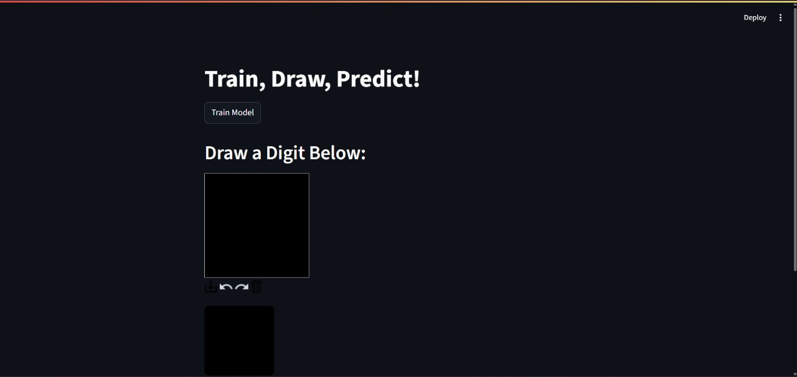
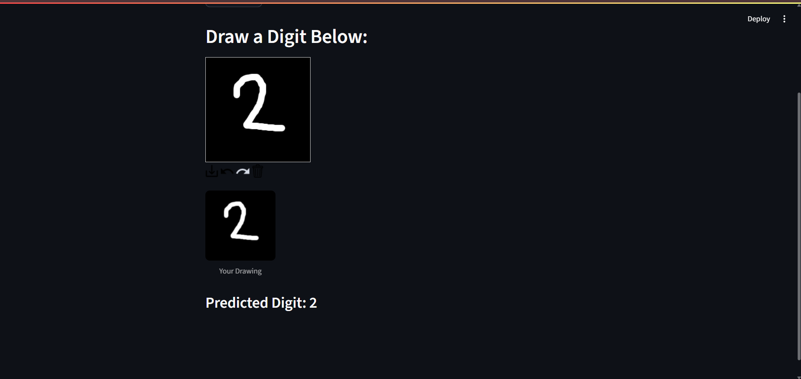

# MLP-Digit-Classification
Handwritten digit classification using an MLP neural network built with scikit-learn. Includes performance metrics and visualization tools. Covers training, testing, confusion matrix, loss curve, and hidden layer weight visualization. 

This project implements a neural network model to recognize handwritten digits using the 'digits' dataset from scikit-learn.

## 📦 Features

- Handwritten digit classification using neural networks
- Training/testing data split for model evaluation
- Visualizations of digit samples, loss curve, misclassified digits, and hidden layer weights
- Confusion matrix for performance analysis

## 🛠️ Technologies Used

- Python 3
- Streamlit
- scikit-learn
- matplotlib
- numpy

## 📸 Results

### Dashboard

### Prediction Output

## 🙋‍♀️ Developed By Khushi Satarkar 

Connect with me here! (Linkedin: [https://www.linkedin.com/in/khushi-satarkar-039056254/])

📚 References

This project was inspired by the tutorial on [https://www.geeksforgeeks.org/recognizing-handwritten-digits-in-scikit-learn/]
